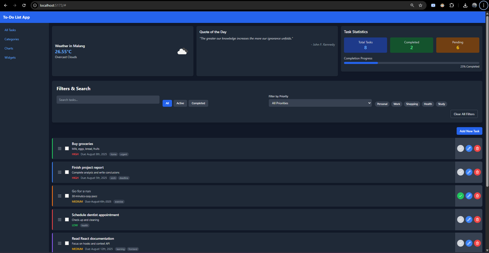
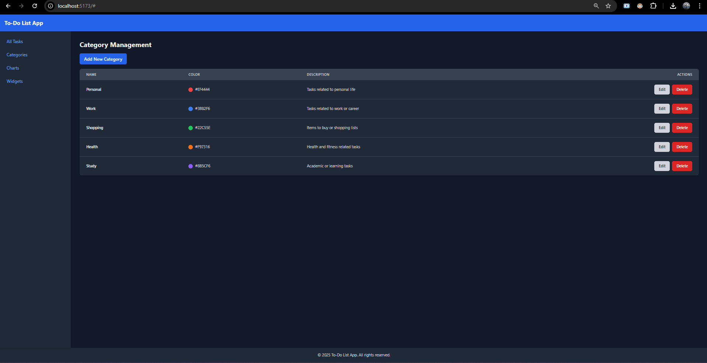
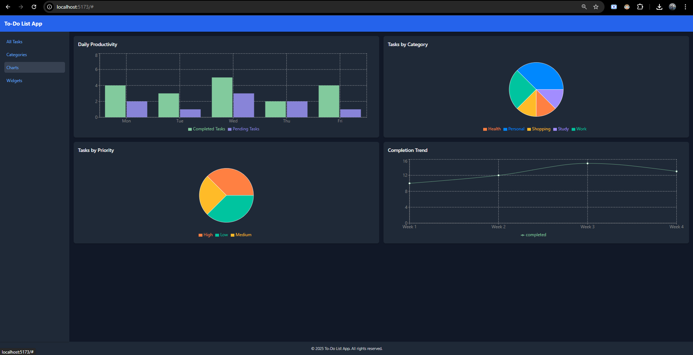
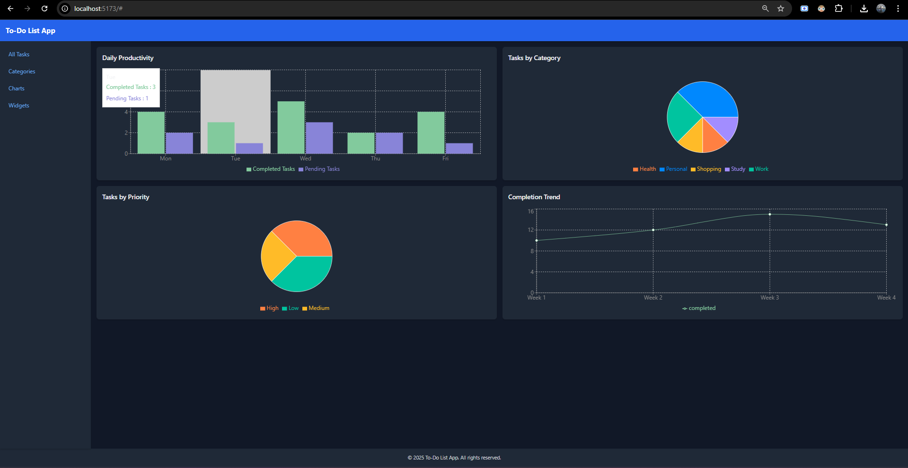

# 🚀 To-Do List App - React.js & Tailwind CSS

A modern, offline-first To-Do List application built with React.js and styled using Tailwind CSS v3. This project serves as a prototype for Business Process Management (BPM) integration, focusing on robust task management, intuitive UI/UX, and readiness for future API integrations.

## ✨ Features

### 1. Task Management (CRUD)
-   **Create**: Add new tasks with validation.
-   **Read**: Display tasks with filtering, search, and sorting.
-   **Update**: Edit tasks (inline or via modal).
-   **Delete**: Remove tasks with confirmation.

### 2. Task Status System
-   Toggle task completion status with visual feedback (checkbox, strike-through, color changes).
-   Progress indicators for completion percentage.

### 3. Categorization System
-   CRUD operations for task categories.
-   Color-coded categories with optional icon support.
-   Default categories: Personal, Work, Shopping, Health, Study.

### 4. Advanced Filtering & Search
-   **Status Filters**: All, Active, Completed.
-   **Category Filters**: Multi-select dropdown.
-   **Text Search**: Real-time search with highlighting.
-   **Priority Filter**: Filter tasks by High, Medium, Low priority.
-   **Date Filters**: Today, This Week, This Month, Custom Range (planned).
-   Combined filters and clear all filters option.

### 5. Data Persistence & API Readiness
-   Offline storage using LocalStorage.
-   Export/Import functionality (JSON format).
-   API service layer ready for REST API integration.
-   Robust loading states and error handling.

### 6. Bonus Features
-   **Drag & Drop**: Reorder tasks with smooth animations using `@dnd-kit/core`. Drag handle implemented for precise control.
-   **Bulk Operations**: Multi-select tasks for bulk actions (Delete, Mark as Complete, Change Category, Change Priority).
-   **Data Visualization**: Productivity charts, category distribution, priority statistics, and trend charts using Chart.js.

## 🛠️ Technology Stack

-   **Frontend**: React 18+ (JavaScript ES6+)
-   **Styling**: Tailwind CSS v3
-   **State Management**: Redux Toolkit + Redux-Saga
-   **HTTP Client**: Axios (for public API integration)
-   **Storage**: LocalStorage (offline-first)
-   **Build Tool**: Vite
-   **Drag & Drop**: `@dnd-kit/core`
-   **Charts**: Chart.js
-   **Validation**: Custom validators
-   **UUID Generation**: `uuid` library

## 🎨 UI/UX Design Principles

-   **Design System**: Modern, clean, minimalist.
-   **Color Scheme**: Professional with accent colors for categories.
-   **Typography**: Readable font hierarchy.
-   **Spacing**: Consistent spacing using Tailwind's scale.
-   **Animations**: Subtle micro-interactions.
-   **Responsive Design**: Mobile-first approach, optimized for all screen sizes (320px+).
-   **Accessibility**: ARIA labels, keyboard navigation, clear focus indicators, WCAG AA color contrast.

## 📂 Component Architecture

```
src/
├── components/
│   ├── common/ (Button, Input, Modal, LoadingSpinner, ConfirmDialog)
│   ├── todo/ (TodoItem, TodoForm, TodoList, TodoStats, DraggableTodoItem)
│   ├── filters/ (SearchBar, StatusFilter, CategoryFilter, PriorityFilter, BulkActions)
│   ├── charts/ (ProductivityChart, CategoryChart, PriorityChart, TrendChart)
│   ├── widgets/ (WeatherWidget, QuoteWidget, StatsWidget)
│   └── layout/ (Header, Sidebar, Footer)
├── store/ (slices, sagas, store.js)
├── services/ (todoService, categoryService, storageService, weatherService, quoteService, jsonPlaceholderService)
├── types/ (todoTypes, categoryTypes, commonTypes)
├── utils/ (dateHelpers, validators, constants, dummyData)
└── hooks/ (useTodos, useCategories, useFilters, useDragDrop, useBulkActions, useWeather, useQuote)
```

## 🌐 Public API Integrations

-   **Weather Service**: Integrates with OpenWeatherMap API to display current weather (e.g., for Malang).
-   **Quote Service**: Fetches daily motivational quotes from `api.quotable.io`.
-   **JSONPlaceholder Service**: Provides sample todo data for initial setup.

## 🚀 Getting Started

### Installation

1.  Clone the repository:
    ```bash
    git clone <repository-url>
    cd todo-list-app
    ```
2.  Install dependencies:
    ```bash
    npm install
    ```

### Running the Application

```bash
npm run dev
```
The application will typically run on `http://localhost:5173` (or another port if 5173 is in use).

## 📸 Screenshots

Here are some screenshots of the application's main views. Please replace these placeholder images with actual screenshots from your running application.

### Tasks View

_This view displays all your tasks, with options for filtering, searching, and bulk actions. Each task item is draggable via its handle._

### Categories View

_Manage your task categories here. You can add, edit, or delete categories, each with a unique color and optional icon._

### Charts View

_Visualize your productivity and task distribution with various charts, including productivity trends, category breakdown, and priority statistics._

### Widgets View

_A dashboard of useful widgets, including current weather, daily motivational quotes, and overall task statistics._

## 🤝 Contributing

Feel free to fork the repository and contribute!

## 📄 License

This project is licensed under the MIT License.